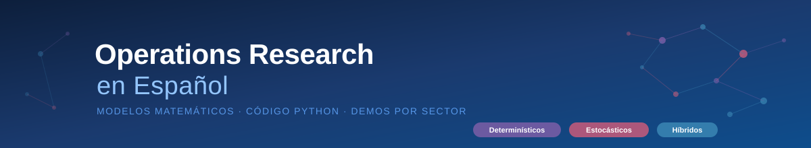
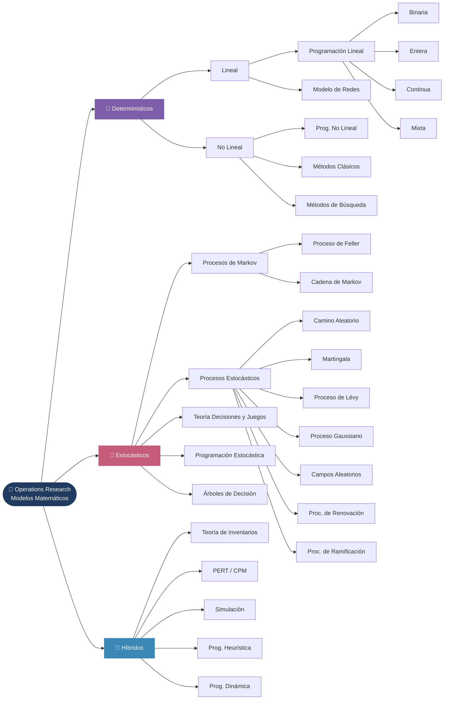

<p align="center">
  
</p>

> **Referencia técnica y práctica de Investigación de Operaciones:**  
> conceptos, algoritmos, código Python ejecutable y demos por sector.

Este repositorio tiene como objetivo reunir en un solo lugar los principales modelos matemáticos de la Investigación de Operaciones, explicados en español, con ejemplos aplicados a sectores reales: industria, banca, logística, transporte y servicios.

Cada tema incluye:
- 📖 Explicación conceptual y fundamentos matemáticos
- 🐍 Código Python ejecutable (notebooks Jupyter)
- 🏭 Casos de uso por sector
- 🔗 Demo interactiva (API de prueba)

---

## 🗺️ Mapa de Contenidos



---

## 📂 Estructura del Repositorio

| Rama | Descripción |
|------|-------------|
| [📐 1\_Deterministicos](./1_Deterministicos/) | Modelos donde los parámetros son conocidos con certeza |
| [🎲 2\_Estocasticos](./2_Estocasticos/) | Modelos que incorporan incertidumbre y probabilidad |
| [🔀 3\_Hibridos](./3_Hibridos/) | Técnicas que combinan elementos determinísticos y estocásticos |

---

## 🚀 Cómo usar este repositorio

### Requisitos

```bash
pip install -r requirements.txt
```

### Ejecutar notebooks

```bash
jupyter notebook
```

Navega a la carpeta del tema de interés y abre el archivo `.ipynb` correspondiente.

---

## 🏭 Aplicaciones por Sector

Los modelos de este repositorio tienen aplicación directa en:

| Sector | Ejemplos de uso |
|--------|-----------------|
| **Industria** | Planificación de producción, corte de materiales, scheduling |
| **Banca y Finanzas** | Gestión de portafolios, evaluación de riesgo, scoring crediticio |
| **Logística** | Ruteo de vehículos, distribución, gestión de almacenes |
| **Transporte** | Flujo en redes, asignación de rutas, timetabling |
| **Servicios** | Programación de turnos, asignación de recursos, colas |
| **Salud** | Programación quirúrgica, distribución de medicamentos |
| **Energía** | Despacho económico, planificación de redes eléctricas |

---

## 🤝 ¿Necesitas ayuda con alguno de estos modelos?

Si tu organización enfrenta un problema de optimización, simulación, toma de decisiones o planificación, puedes contactarme:

- 📧 **Email:** `[tu@email.com]`
- 💼 **LinkedIn:** *(agregar enlace)*
- 🔗 **Demos disponibles:** Cada tema cuenta con una API de prueba para que puedas interactuar con el modelo directamente.

---

## 📄 Licencia

[MIT](./LICENSE) — Libre uso con atribución.
