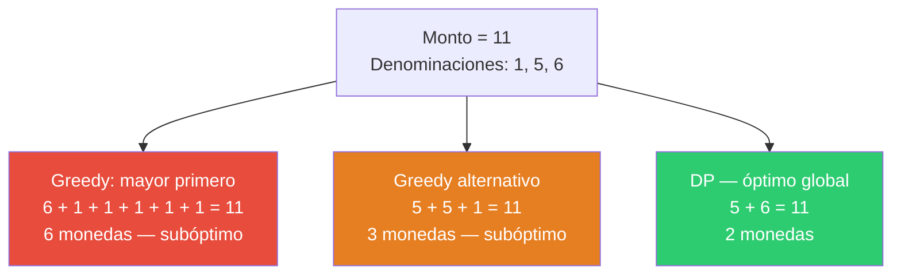

# Ejemplos — Cambio de Monedas

## Caso Base — Datos del problema

| Parámetro | Valor |
|---|---|
| Denominaciones $D$ | $\{1, 5, 6\}$ |
| Monto objetivo $C$ | 11 |
| Solución óptima $z^*$ | 2 monedas |

---

## Posibilidades a resolver



---

## Vector DP desplegado

La tabla se construye de izquierda a derecha: para cada monto $c$ de 1 a 11, se evalúan todas las denominaciones $d \in \{1, 5, 6\}$ con $d \leq c$ y se elige la que minimiza $1 + dp[c - d]$.

| $c$ | 0 | 1 | 2 | 3 | 4 | 5 | 6 | 7 | 8 | 9 | 10 | 11 |
|---|---|---|---|---|---|---|---|---|---|---|---|---|
| $dp[c]$ | 0 | 1 | 2 | 3 | 4 | 1 | 1 | 2 | 3 | 4 | 2 | 2 |
| moneda usada | — | 1 | 1 | 1 | 1 | 5 | 6 | 1 | 1 | 1 | 5 | 5 |

**Cálculo celda a celda:**

| $c$ | Evaluaciones | Elegida | $dp[c]$ |
|---|---|---|---|
| 1 | $1+dp[0]=1$ | $d=1$ | 1 |
| 2 | $1+dp[1]=2$ | $d=1$ | 2 |
| 3 | $1+dp[2]=3$ | $d=1$ | 3 |
| 4 | $1+dp[3]=4$ | $d=1$ | 4 |
| 5 | $1+dp[4]=5$; $1+dp[0]=1$ | $d=5$ | 1 |
| 6 | $1+dp[5]=2$; $1+dp[1]=2$; $1+dp[0]=1$ | $d=6$ | 1 |
| 7 | $1+dp[6]=2$; $1+dp[2]=3$; $1+dp[1]=2$ | $d=1$ | 2 |
| 8 | $1+dp[7]=3$; $1+dp[3]=4$; $1+dp[2]=3$ | $d=1$ | 3 |
| 9 | $1+dp[8]=4$; $1+dp[4]=5$; $1+dp[3]=4$ | $d=1$ | 4 |
| 10 | $1+dp[9]=5$; $1+dp[5]=2$; $1+dp[4]=5$ | $d=5$ | 2 |
| 11 | $1+dp[10]=3$; $1+dp[6]=2$; $1+dp[5]=2$ | $d=5$ | 2 |

---

## Restricciones desplegadas para la celda clave $dp[11]$

**R1 — Monto exacto:** la reconstrucción por backtracking produce $5 + 6 = 11$ ✓

**R2 — Recurrencia DP:**

$$dp[11] = \min\bigl(1 + dp[10],\; 1 + dp[6],\; 1 + dp[5]\bigr) = \min(3,\; 2,\; 2) = 2$$

La denominación $d = 5$ es la primera en alcanzar el mínimo 2 (iterando en orden $[1, 5, 6]$), por lo que `moneda_usada[11] = 5`.

**R3 — Denominaciones válidas:** $5 \in \{1, 5, 6\}$ ✓

---

## Solución óptima

**Backtracking:**

| Paso | $c$ actual | Denominación usada | $c$ siguiente |
|---|---|---|---|
| 1 | 11 | 5 (`moneda_usada[11]`) | 6 |
| 2 | 6 | 6 (`moneda_usada[6]`) | 0 |

Monedas seleccionadas: **{5, 6}** — total $5 + 6 = 11$.

| Parámetro | Valor |
|---|---|
| Valor óptimo $z^*$ | **2 monedas** |
| Selección | denominación 6 × 1, denominación 5 × 1 |
| Verificación | $6 + 5 = 11$ ✓ |

---

## Salida del programa — `caso_base.py`

```
========================================
CAMBIO DE MONEDAS - CASO BASE
========================================
Denominaciones       : [1, 5, 6]
Monto objetivo       : 11

Monedas seleccionadas:
  Denominacion   6  x1
  Denominacion   5  x1

Total de monedas  : 2
Verificacion      : 6 + 5 = 11
========================================
```

---

## Salida del programa — `caso_extendido.py`

Instancia extendida: denominaciones $\{1, 3, 4, 7, 11\}$, monto 25. Solución óptima: $11 + 11 + 3 = 25$ (**3 monedas**).

```
========================================
CAMBIO DE MONEDAS - CASO EXTENDIDO
========================================
Denominaciones       : [1, 3, 4, 7, 11]
Monto objetivo       : 25

Vector dp completo:
  c  |  0  1  2  3  4  5  6  7  8  9 10 11 12 13 14 15 16 17 18 19 20 21 22 23 24 25
dp[c]|  0  1  2  1  1  2  2  1  2  3  2  1  2  3  2  2  3  3  2  3  4  3  2  3  4  3

Monedas seleccionadas:
  Denominacion  11  x2
  Denominacion   3  x1

Total de monedas  : 3
Verificacion      : 11 + 11 + 3 = 25
========================================
```

---

## Cómo ejecutar

```bash
# Caso base
python caso_base.py

# Caso extendido
python caso_extendido.py
```
