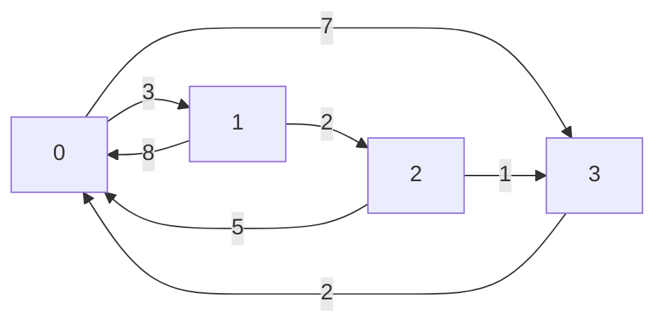

# Fundamentos — Caminos mas Cortos: Floyd-Warshall

## ¿Que es el problema?

El problema de *All-Pairs Shortest Paths* (*APSP*) consiste en calcular la distancia
minima entre **todos los pares de nodos** $(i, j)$ de un grafo dirigido ponderado.
A diferencia de los problemas de camino mas corto desde un unico origen (*single-source
shortest path*, *SSSP*), el APSP requiere conocer la ruta optima entre cualquier par
posible de nodos, lo que lo hace indispensable en aplicaciones de enrutamiento, logistica
y analisis de redes.

El algoritmo de **Floyd-Warshall** (Floyd, 1962; Warshall, 1962) es la solucion
clasica de programacion dinamica (*dynamic programming*, *DP*) para el APSP. Opera en
tiempo $O(V^3)$ y espacio $O(V^2)$ sobre grafos densos (*dense graphs*) con $V$ nodos,
y acepta aristas con pesos negativos siempre que no existan ciclos negativos
(*negative cycles*).

### Comparacion con otros algoritmos de caminos cortos

| Algoritmo | Origen | Pesos negativos | Complejidad |
|---|---|---|---|
| Dijkstra | Un origen | No | $O((E + V) \log V)$ |
| Bellman-Ford | Un origen | Si (detecta ciclos negativos) | $O(VE)$ |
| Floyd-Warshall | **Todos los pares** | Si (detecta ciclos negativos) | $O(V^3)$ |

Ejecutar Dijkstra $V$ veces cuesta $O(V \cdot (E + V \log V))$, que es preferible
cuando el grafo es disperso ($E \ll V^2$). Floyd-Warshall supera esta alternativa
en grafos densos donde $E \approx V^2$.

---

## Contexto del ejemplo

Una empresa de distribucion logistica opera una red de 4 bodegas interconectadas
(nodos 0, 1, 2 y 3). Cada arista dirigida representa una ruta entre dos bodegas con
un costo asociado (tiempo de viaje en horas). Para optimizar el despacho en cualquier
escenario, el sistema necesita conocer la ruta mas corta entre **todos los pares** de
bodegas, no solo desde un punto de origen fijo.

### Grafo de la red logistica

**Lista de aristas:**

| Origen | Destino | Costo |
|:---:|:---:|:---:|
| 0 | 1 | 3 |
| 0 | 3 | 7 |
| 1 | 0 | 8 |
| 1 | 2 | 2 |
| 2 | 0 | 5 |
| 2 | 3 | 1 |
| 3 | 0 | 2 |

**Matriz de adyacencia inicial** ($\infty$ indica que no existe arista directa):

$$
W = \begin{pmatrix}
0 & 3 & \infty & 7 \\
8 & 0 & 2 & \infty \\
5 & \infty & 0 & 1 \\
2 & \infty & \infty & 0
\end{pmatrix}
$$

---

## Aplicaciones por sector

| Sector | Aplicacion concreta |
|---|---|
| Transporte y logistica | Calculo de rutas optimas entre multiples origenes y destinos en flotas de vehiculos |
| Redes IP | Enrutamiento de paquetes; los routers mantienen tablas de distancias entre todos los nodos |
| Analisis de grafos sociales | Diametro de la red, centralidad de intermediacion (*betweenness centrality*) |
| Planificacion logistica | Optimizacion de centros de distribucion; minimizacion del tiempo total de entrega |
| Sistemas GPS | Pre-calculo de distancias entre regiones en mapas de gran escala |
| Finanzas (deteccion de arbitraje) | Un ciclo negativo en un grafo de tasas de cambio indica una oportunidad de arbitraje |
| Bioinformatica | Alineacion de secuencias mediante matrices de distancias entre todos los pares |
| Juegos y simulacion | Calculo de distancias en mapas de cuadricula para IA de personajes |
