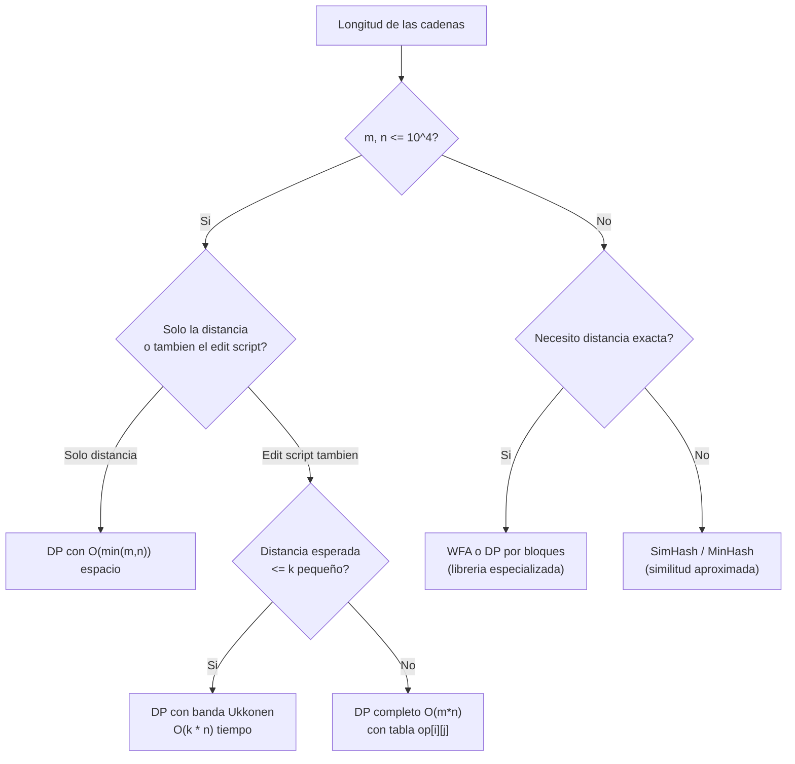

# Complejidad — Distancia de Edición

## Clase del problema

La Distancia de Edición (Levenshtein) pertenece a la clase **P** (polinomial). Existe un algoritmo exacto que la resuelve en tiempo polinomial mediante programación dinámica (*dynamic programming*, DP):

| Métrica | DP estándar | DP con espacio optimizado |
|---|---|---|
| Tiempo | $O(m \cdot n)$ | $O(m \cdot n)$ |
| Espacio | $O(m \cdot n)$ | $O(\min(m, n))$ |
| Reconstrucción del edit script | Sí | No |

donde $m = |\text{src}|$ y $n = |\text{dst}|$.

El algoritmo llena una tabla completa de $(m+1)(n+1)$ celdas. Cada celda se calcula en tiempo $O(1)$. No existe un algoritmo general más rápido que $O(m \cdot n)$ bajo los modelos computacionales estándar para el caso general (la prueba de dureza cuadrática bajo SETH es un resultado activo de investigación).

---

## Crecimiento con el tamaño de la entrada

La cuadraticidad en $m$ y $n$ impone un límite práctico. A continuación se muestra el costo de la tabla DP para distintos pares de longitudes:

| $m$ | $n$ | Celdas ($m \times n$) | Tiempo aprox. | Espacio ($O(m \cdot n)$) |
|---|---|---|---|---|
| 10 | 10 | 100 | < 1 µs | < 1 KB |
| 100 | 100 | 10,000 | < 1 ms | ~80 KB |
| 1,000 | 1,000 | 1,000,000 | ~10 ms | ~8 MB |
| 10,000 | 10,000 | 100,000,000 | ~1 s | ~800 MB |
| 100,000 | 100,000 | $10^{10}$ | ~100 s | ~80 GB |
| $10^6$ | $10^6$ | $10^{12}$ | inviable | inviable |

Para cadenas cortas (palabras de diccionario, identificadores) el DP estándar es completamente adecuado. Para documentos largos o secuencias genómicas completas es necesario recurrir a técnicas de mitigación.

---

## Técnicas de mitigación

### Reducción de espacio a $O(\min(m, n))$

Si solo se necesita la distancia (sin el edit script), basta con conservar dos filas de la tabla: la fila anterior y la fila actual. Esto reduce el espacio de $O(m \cdot n)$ a $O(n)$ (tomando $n \leq m$).

```python
def edit_distance_espacio_optimo(src, dst):
    """Distancia de Levenshtein con O(min(m,n)) espacio."""
    if len(src) < len(dst):
        src, dst = dst, src          # garantizar que dst es la cadena mas corta
    m, n = len(src), len(dst)
    fila_anterior = list(range(n + 1))

    for i in range(1, m + 1):
        fila_actual = [i] + [0] * n
        for j in range(1, n + 1):
            if src[i - 1] == dst[j - 1]:
                fila_actual[j] = fila_anterior[j - 1]
            else:
                fila_actual[j] = 1 + min(
                    fila_anterior[j],      # eliminacion
                    fila_actual[j - 1],    # insercion
                    fila_anterior[j - 1],  # sustitucion
                )
        fila_anterior = fila_actual

    return fila_anterior[n]
```

**Limitacion**: al descartar filas anteriores, no es posible reconstruir el edit script. Para recuperar la secuencia de operaciones se necesita la tabla completa o el algoritmo de Hirschberg ($O(m \cdot n)$ tiempo, $O(\min(m, n))$ espacio con reconstrucción).

### Algoritmo de Ukkonen: banda diagonal de ancho $2k+1$

Si el objetivo es únicamente verificar si $d(\text{src}, \text{dst}) \leq k$ (aceptar/rechazar un umbral), no es necesario calcular toda la tabla. Solo las celdas dentro de una banda diagonal de semiancho $k$ pueden contribuir a una solución de costo $\leq k$. Las celdas fuera de la banda se inicializan a $\infty$ y se excluyen del cálculo.

**Complejidad con umbral $k$**: $O(k \cdot \min(m, n))$ tiempo y $O(k)$ espacio.

| Caso | Tiempo | Espacio |
|---|---|---|
| $k \ll \min(m, n)$ | $O(k \cdot n)$ — lineal en $n$ para $k$ fijo | $O(k)$ |
| $k = O(\min(m, n))$ | $O(m \cdot n)$ — degrada al DP completo | $O(n)$ |

Este enfoque es especialmente útil en correctores ortográficos donde solo interesan palabras con distancia $\leq 2$ o $\leq 3$.

### Para cadenas muy largas: similitud aproximada

Cuando las cadenas tienen longitudes del orden de $10^4$–$10^6$ caracteres, incluso el DP con banda puede ser costoso. Las alternativas son:

| Técnica | Complejidad | Descripción |
|---|---|---|
| SimHash (*locality-sensitive hashing*) | $O(n)$ tiempo, $O(1)$ espacio de comparación | Proyecta el documento a un vector de bits; distancia de Hamming aproxima la similitud |
| MinHash | $O(n \cdot k)$ para $k$ funciones hash | Estima la similitud de Jaccard entre conjuntos de n-gramas; eficaz para deduplicación |
| Distancia de bloques | $O(n / w)$ con instrucciones SIMD | Procesa $w$ bits en paralelo; implementado en `editdistance` y WFA |
| WFA (*Wavefront Alignment*) | $O(n + d^2)$ donde $d$ = distancia | Óptimo en la práctica cuando $d \ll n$; usado en bioinformática moderna |

---

## ¿Cuándo cambiar de enfoque?



| Escenario | Enfoque recomendado | Complejidad |
|---|---|---|
| Corrector ortográfico (palabras cortas) | DP completo o Ukkonen ($k \leq 3$) | $O(k \cdot n)$ |
| Deduplicación de nombres en BD | DP con espacio $O(n)$ | $O(m \cdot n)$ |
| Alineamiento de lecturas genómicas | WFA o Smith-Waterman SIMD | $O(n + d^2)$ |
| Deduplicación de documentos largos | SimHash / MinHash | $O(n)$ por documento |
| Evaluación de traducción (TER) | DP a nivel de palabras | $O(m_w \cdot n_w)$ con $m_w, n_w$ = tokens |
