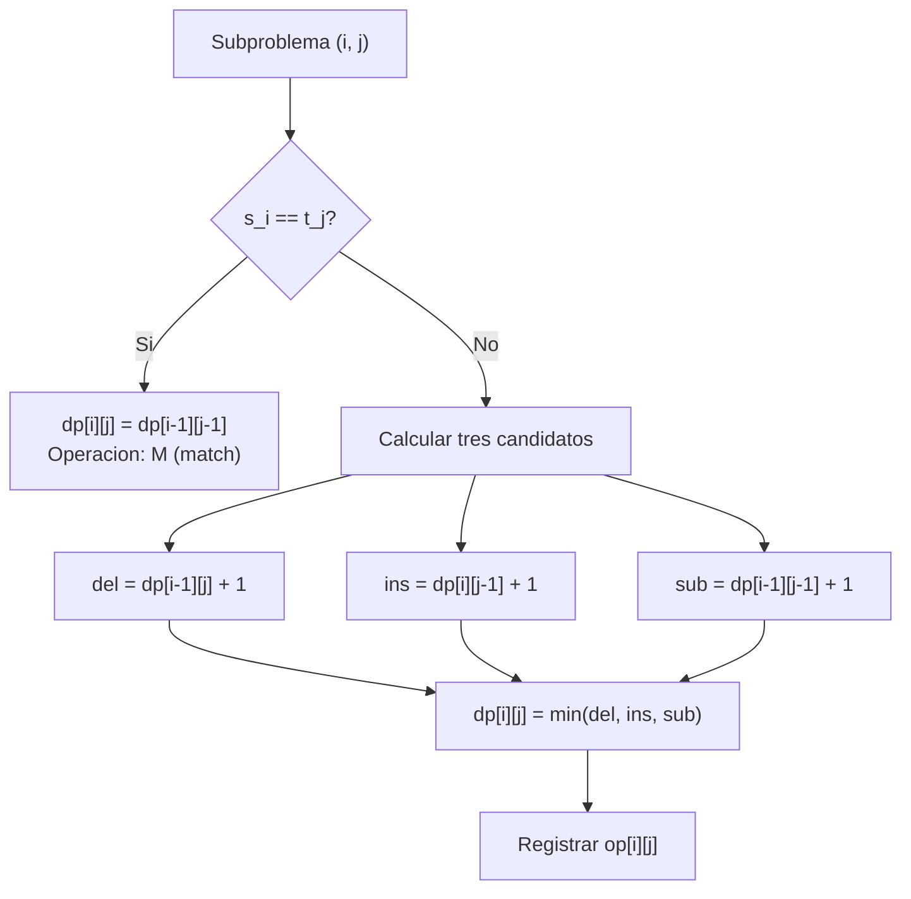

# Formulación — Distancia de Edición

## El reto de transformación

Dadas dos cadenas `src` (fuente) y `dst` (destino) de longitudes $m$ y $n$ respectivamente, el espacio de búsqueda de posibles secuencias de operaciones de edición crece de forma exponencial con la longitud de las cadenas. Para cada posición existe la opción de insertar, eliminar, sustituir o no hacer nada, lo que genera un árbol de posibilidades de tamaño $O(3^{\max(m,n)})$ en el peor caso.

La programación dinámica (*dynamic programming*, DP) elimina este crecimiento al observar que el problema tiene **subestructura óptima** (*optimal substructure*): la distancia mínima para transformar los primeros $i$ caracteres de `src` en los primeros $j$ de `dst` depende exclusivamente de los subproblemas de tamaño $(i-1, j)$, $(i, j-1)$ e $(i-1, j-1)$. Además, los mismos subproblemas aparecen repetidamente en la recursión (**solapamiento de subproblemas**, *overlapping subproblems*), lo que justifica memorizarlos en una tabla.

El enfoque DP bottom-up resuelve el problema en tiempo $O(m \cdot n)$ y espacio $O(m \cdot n)$; reducible a $O(\min(m, n))$ si solo se necesita el valor final, no la reconstrucción.

---

## Conjuntos y Parámetros

**Cadenas:**

$$\text{src} = s_1\, s_2\, \cdots\, s_m, \qquad \text{dst} = t_1\, t_2\, \cdots\, t_n$$

**Índices:**

$$i \in \{0, 1, \ldots, m\}, \qquad j \in \{0, 1, \ldots, n\}$$

**Costos (versión Levenshtein estándar):**

$$c_{\text{ins}} = 1, \qquad c_{\text{del}} = 1, \qquad c_{\text{sub}} = 1$$

En variantes ponderadas (Damerau, Levenshtein generalizado) estos costos pueden diferir. En bioinformática se usan matrices de sustitución (*substitution matrices*) como BLOSUM62 o PAM250.

---

## Variable de decisión

Se definen dos tablas de tamaño $(m+1) \times (n+1)$:

**Tabla de costos mínimos:**

$$dp[i][j] \in \mathbb{Z}_{\geq 0}$$

$dp[i][j]$ almacena el número mínimo de operaciones de edición para transformar el prefijo $s_1 \cdots s_i$ en el prefijo $t_1 \cdots t_j$.

**Tabla de operaciones (para reconstrucción del edit script):**

$$op[i][j] \in \{\text{M},\, \text{S},\, \text{D},\, \text{I}\}$$

donde M = match (sin cambio), S = sustitución (*substitute*), D = eliminación (*delete*), I = inserción (*insert*). Esta tabla permite recuperar la secuencia exacta de operaciones por backtracking desde $(m, n)$ hasta $(0, 0)$.

---

## Función objetivo

$$\min \quad dp[m][n]$$

Minimizar el número total de operaciones de edición para transformar completamente `src` en `dst`.

---

## Restricciones

**R1 — Casos base:**

$$dp[0][j] = j \quad \forall\, j \in \{0, \ldots, n\}$$
$$dp[i][0] = i \quad \forall\, i \in \{0, \ldots, m\}$$

Transformar una cadena vacía en $t_1 \cdots t_j$ requiere exactamente $j$ inserciones. Transformar $s_1 \cdots s_i$ en la cadena vacía requiere exactamente $i$ eliminaciones.

**R2 — Recurrencia DP:**

Para $i \in \{1, \ldots, m\}$ y $j \in \{1, \ldots, n\}$:

$$dp[i][j] = \begin{cases}
dp[i-1][j-1] & \text{si } s_i = t_j \quad (\text{match, sin costo}) \\[6pt]
1 + \min\!\bigl(dp[i-1][j],\; dp[i][j-1],\; dp[i-1][j-1]\bigr) & \text{si } s_i \neq t_j
\end{cases}$$

Interpretación de cada término cuando $s_i \neq t_j$:

- $dp[i-1][j] + 1$: se **elimina** $s_i$ de la fuente y se resuelve el subproblema $(i-1, j)$.
- $dp[i][j-1] + 1$: se **inserta** $t_j$ en la fuente y se resuelve el subproblema $(i, j-1)$.
- $dp[i-1][j-1] + 1$: se **sustituye** $s_i$ por $t_j$ y se resuelve el subproblema $(i-1, j-1)$.

**R3 — Costos de operaciones:**

En la versión estándar de Levenshtein, $c_{\text{ins}} = c_{\text{del}} = c_{\text{sub}} = 1$. La extensión natural permite costos diferenciados:

$$dp[i][j] = \min\!\bigl(dp[i-1][j] + c_{\text{del}},\; dp[i][j-1] + c_{\text{ins}},\; dp[i-1][j-1] + c_{\text{sub}}(s_i, t_j)\bigr)$$

donde $c_{\text{sub}}(s_i, t_j) = 0$ si $s_i = t_j$ (sin costo por match). Esta generalización no rompe la subestructura óptima.

**R4 — Edit script:**

La secuencia de operaciones reconstruida mediante backtracking en la tabla $op$ contiene exactamente $dp[m][n]$ operaciones no triviales (S, D o I). Las operaciones de tipo M (match) no incrementan el costo.

```
backtrack(i, j):
    si i == 0 y j == 0: terminar
    si op[i][j] == 'M': backtrack(i-1, j-1)   -- sin operacion de costo
    si op[i][j] == 'S': backtrack(i-1, j-1)   -- sustitucion
    si op[i][j] == 'D': backtrack(i-1, j)     -- eliminacion
    si op[i][j] == 'I': backtrack(i, j-1)     -- insercion
```

---

## Herramientas disponibles

| Herramienta | Descripción | Caso de uso |
|---|---|---|
| Python estándar (DP) | Implementación manual, $O(m \cdot n)$ | Aprendizaje, control total |
| `difflib.SequenceMatcher` | Ratio de similitud (no distancia exacta) | Comparación rápida de textos |
| `python-Levenshtein` | Bindings C, muy rápido | Procesamiento en lote |
| `editdistance` | Binding C++ optimizado | Producción de alto rendimiento |
| `jellyfish` | Varias métricas de similitud de cadenas | Análisis fonético y de texto |

---

## Extensión: Distancia de Damerau-Levenshtein

La distancia de Damerau-Levenshtein añade una cuarta operación: la **transposición** (*transposition*) de dos caracteres adyacentes, con costo 1.

$$dp[i][j] = \min\!\begin{cases}
dp[i-1][j] + 1 & \text{(eliminacion)} \\
dp[i][j-1] + 1 & \text{(insercion)} \\
dp[i-1][j-1] + c_{\text{sub}} & \text{(sustitucion o match)} \\
dp[i-2][j-2] + 1 & \text{si } s_i = t_{j-1} \text{ y } s_{i-1} = t_j \text{ (transposicion)}
\end{cases}$$

Esta variante es más adecuada para modelar errores tipográficos humanos (intercambiar dos letras adyacentes es el error más frecuente al escribir). La complejidad permanece en $O(m \cdot n)$ pero con una constante ligeramente mayor.


