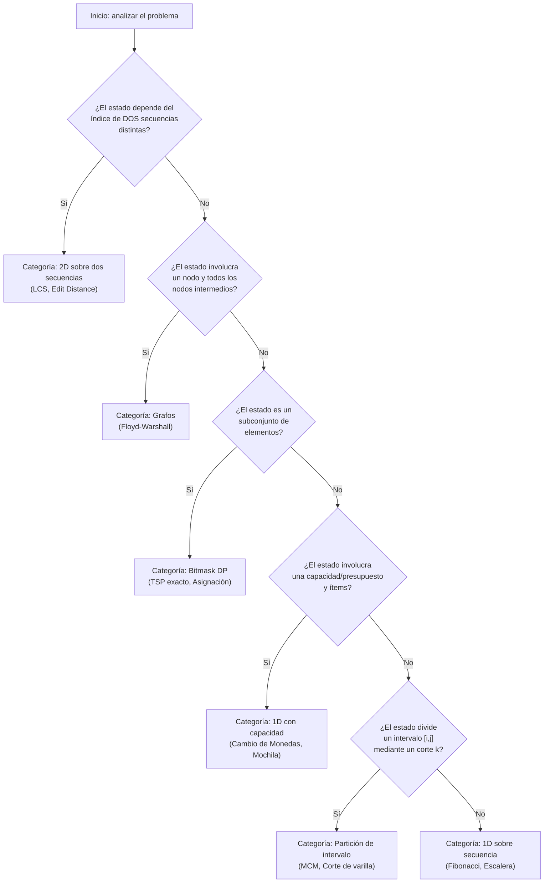

# Clasificación de Problemas DP

## Taxonomía por estructura del estado

La estructura del estado define la forma de la tabla DP y el patrón de la transición. Identificar la categoría de un problema es el primer paso para seleccionar la recurrencia correcta. La siguiente tabla cubre las categorías más frecuentes en la literatura y en este repositorio.

| Categoría | Dimensión de la tabla | Tipo de recurrencia | Ejemplos en este repositorio | Complejidad típica |
|---|---|---|---|---|
| **1D sobre secuencia** | $O(n)$ | Acceso a posiciones o elementos previos de la misma secuencia | Fibonacci, Escalera | $O(n)$ |
| **1D de minimización/maximización con capacidad** | $O(n \cdot C)$ | Ítems procesados vs. capacidad residual | **Cambio de Monedas**, Mochila 1D | $O(n \cdot C)$ |
| **2D sobre dos secuencias** | $O(m \cdot n)$ | Match/no-match entre caracteres o elementos de dos cadenas/arreglos | **LCS**, **Edit Distance** | $O(m \cdot n)$ |
| **2D en subarray/subproblema cuadrado** | $O(n^2)$ | Partición de una secuencia en subproblemas por corte | MCM, Palíndromo más largo | $O(n^2)$ a $O(n^3)$ |
| **En grafos (matriz de distancias)** | $O(V^2)$ por iteración | Nodo intermedio que relaja la distancia entre pares | **Floyd-Warshall**, DAG shortest path | $O(V^3)$ |
| **En árboles** | $O(n)$ | Raíz a hojas o hojas a raíz; cada nodo depende de sus hijos o padre | Tree DP, Conjunto independiente máximo | $O(n)$ |
| **De partición** | $O(n^2)$ a $O(n^3)$ | Corte óptimo en alguna posición del intervalo $[i, j]$ | Matrix Chain Multiplication, Corte de varilla | $O(n^3)$ |
| **Con perfil de bitmask** | $O(2^n \cdot n)$ | Subconjunto de elementos representado como máscara de bits | TSP exacto, Asignación óptima | $O(2^n \cdot n)$ |

---

## Guía de selección rápida

El siguiente árbol de decisión sugiere la categoría DP más probable según las características del problema. Las condiciones se evalúan en orden; al cumplirse una, se detiene la búsqueda.

---

## Contenido de este repositorio por categoría

La siguiente tabla mapea cada carpeta de problema a su categoría DP y tipo de optimización.

| Carpeta | Categoría | Tipo de optimización |
|---|---|---|
| `Mochila_0-1/` | 2D (ítems × capacidad) | Maximización del valor total |
| `Cambio_Monedas/` | 1D con capacidad | Minimización del número de monedas |
| `Subsecuencia_Comun_LCS/` | 2D sobre dos secuencias | Maximización de la longitud de la subsecuencia común |
| `Distancia_Edicion/` | 2D sobre dos secuencias | Minimización del número de operaciones de edición |
| `Caminos_Cortos_Floyd-Warshall/` | En grafos (todos los pares) | Minimización de la distancia entre todos los pares de nodos |

---

## Notas sobre complejidad y escalabilidad

La complejidad de un algoritmo DP es el producto del número de subproblemas por el costo de cada transición:

$$T = |\text{subproblemas}| \times |\text{costo de transición}|$$

| Categoría | Número de subproblemas | Costo de transición | Complejidad total |
|---|---|---|---|
| 1D secuencia | $O(n)$ | $O(1)$ | $O(n)$ |
| 1D con capacidad | $O(n \cdot C)$ | $O(1)$ | $O(n \cdot C)$ |
| 2D dos secuencias | $O(m \cdot n)$ | $O(1)$ | $O(m \cdot n)$ |
| Partición $[i,j]$ | $O(n^2)$ | $O(n)$ (por corte $k$) | $O(n^3)$ |
| Grafos todos pares | $O(V^2)$ | $O(V)$ (por nodo intermedio) | $O(V^3)$ |
| Bitmask | $O(2^n \cdot n)$ | $O(1)$ a $O(n)$ | $O(2^n \cdot n)$ a $O(2^n \cdot n^2)$ |

El bitmask DP es exponencial en $n$ y resulta práctico solo para instancias pequeñas (típicamente $n \leq 20$). Para problemas de asignación de mayor tamaño se recurre a métodos de optimización combinatoria o aproximaciones.
