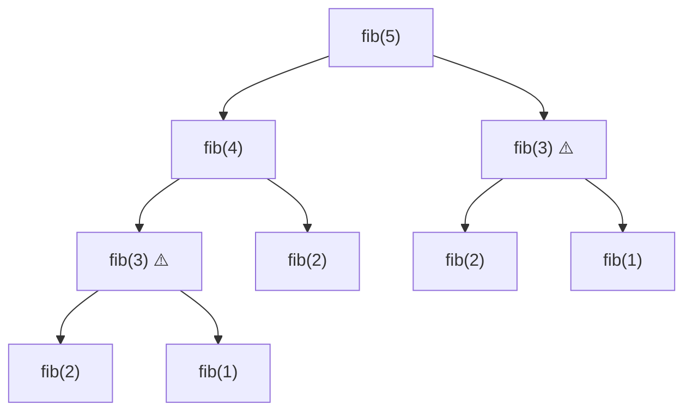

# Paradigma — Programación Dinámica

## ¿Qué es la Programación Dinámica?

La *programación dinámica* (*dynamic programming*, DP) es una técnica de optimización y conteo que resuelve problemas descomponiéndolos en subproblemas superpuestos (*overlapping subproblems*) y almacenando las soluciones de esos subproblemas para evitar recomputación. A diferencia de lo que sugiere el nombre, no es un algoritmo concreto sino un **paradigma de diseño** (*design paradigm*): una manera de estructurar la búsqueda de la solución óptima.

El término fue acuñado por Richard Bellman en 1957 para describir un método de resolución de problemas de decisión secuencial. La palabra "programación" se usaba en el sentido de planificación, no de codificación. Bellman articuló el fundamento teórico en su **principio de optimalidad**:

> "Una política óptima tiene la propiedad de que, sin importar el estado inicial y la decisión inicial, las decisiones restantes deben constituir una política óptima con respecto al estado resultante de la primera decisión."
>
> — Richard Bellman, *Dynamic Programming* (1957)

La DP es aplicable cuando un problema de optimización exhibe dos propiedades estructurales:

1. **Subestructura óptima** (*optimal substructure*): la solución óptima del problema puede construirse a partir de soluciones óptimas de sus subproblemas.
2. **Subproblemas traslapados** (*overlapping subproblems*): el espacio de subproblemas es pequeño y los mismos subproblemas se resuelven repetidamente durante la búsqueda.

---

## Subestructura óptima (*Optimal Substructure*)

Un problema exhibe *subestructura óptima* si la solución óptima del problema contiene en su interior soluciones óptimas de sus subproblemas.

**Ejemplo ilustrativo — camino más corto:**

Sea $\delta(u, v)$ la distancia del camino más corto entre los vértices $u$ y $v$ en un grafo con pesos no negativos. Si el camino más corto de $A$ a $C$ pasa por un vértice intermedio $B$, entonces:

$$\delta(A, C) = \delta(A, B) + \delta(B, C)$$

Es decir, el subcamino $A \to B$ debe ser el camino más corto de $A$ a $B$, y el subcamino $B \to C$ debe ser el camino más corto de $B$ a $C$.

**Argumento de intercambio (*cut-and-paste argument*):**

Suponer que la solución óptima del problema contiene una solución subóptima a algún subproblema. Entonces es posible "cortar" esa solución subóptima y "pegar" la solución óptima del subproblema en su lugar, obteniendo una solución global de menor costo. Esto contradice la hipótesis de que la solución original era óptima. Por lo tanto, la subestructura óptima debe sostenerse.

> **Advertencia:** No todos los problemas de optimización satisfacen esta propiedad. El camino más *largo* simple en un grafo con ciclos no la satisface: el camino más largo de $A$ a $C$ no necesariamente contiene el camino más largo de $A$ a $B$.

---

## Subproblemas traslapados (*Overlapping Subproblems*)

Un problema tiene *subproblemas traslapados* cuando un algoritmo recursivo revisita los mismos subproblemas repetidamente. Esta propiedad distingue a la DP del paradigma de **divide y vencerás** (*divide and conquer*):

| Propiedad | Divide y Vencerás | Programación Dinámica |
|---|---|---|
| Naturaleza de los subproblemas | Independientes y disjuntos | Superpuestos y repetidos |
| Aprovechamiento de resultados | No (cada subproblema se resuelve una vez por definición) | Sí (memoización o tabulación) |
| Ejemplo canónico | Mergesort, Quicksort | Fibonacci, Mochila |

**Ejemplo — Fibonacci recursivo ingenuo:**

La definición recursiva $F(n) = F(n-1) + F(n-2)$, con $F(0) = 0$, $F(1) = 1$, genera el siguiente árbol de llamadas para $F(5)$:

El símbolo ⚠️ marca los subproblemas que se calculan más de una vez. Sin memorización, el costo es $O(2^n)$. Con *memoización* (*memoization*), cada subproblema se calcula exactamente una vez, reduciendo el costo a $O(n)$.

---

## Diferencias con otros paradigmas

| Dimensión | Programación Dinámica | Divide y Vencerás | Greedy |
|---|---|---|---|
| Naturaleza de los subproblemas | Superpuestos y reutilizados | Independientes y disjuntos | Subproblema único por nivel |
| Garantía de optimalidad | Sí, si la subestructura óptima se cumple | Sí, por construcción del problema | Solo si la elección greedy es correcta |
| Requiere explorar todas las decisiones | Sí (implícitamente, vía tabla) | Sí, pero sin superposición | No: elige una sola opción por paso |
| Complejidad típica | Polinomial en el número de subproblemas × transiciones | $O(n \log n)$ en la mayoría de casos | $O(n \log n)$ o $O(n)$ |
| Ejemplos canónicos | Mochila 0/1, LCS, Floyd-Warshall | Mergesort, FFT, Karatsuba | Dijkstra, Huffman, Kruskal |

---

## Principio de optimalidad de Bellman

El principio de optimalidad puede enunciarse formalmente de la siguiente manera:

> Sea $x_1, x_2, \ldots, x_n$ una secuencia de decisiones que constituye una política óptima para un problema de $n$ etapas. Entonces, para todo $k \in \{1, \ldots, n-1\}$, la subsecuencia $x_{k+1}, \ldots, x_n$ es una política óptima para el subproblema que comienza en el estado alcanzado tras la decisión $x_k$.

Este principio es la **condición necesaria** para que la DP sea aplicable. Si el principio no se sostiene, la DP no garantiza la optimalidad global.

**Cuándo NO se cumple:**

- **Caminos más largos simples en grafos con ciclos:** la subestructura no se mantiene porque el camino más largo de $A$ a $C$ puede requerir un subcamino de $A$ a $B$ que no es el más largo entre esos vértices (para evitar ciclos).
- **Problemas con restricciones de integridad no descomponibles:** cuando la factibilidad del subproblema depende de decisiones globales que no pueden separarse.

En la práctica, verificar la subestructura óptima es el primer paso al diseñar un algoritmo DP: se formula la recurrencia y se comprueba que la transición sea correcta mediante el argumento de intercambio.
