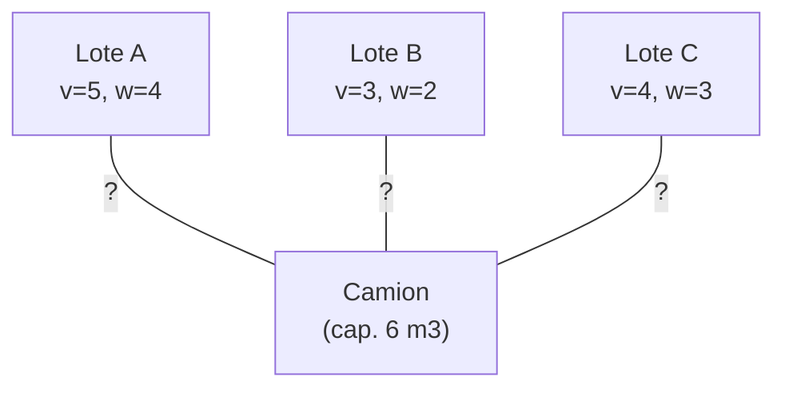
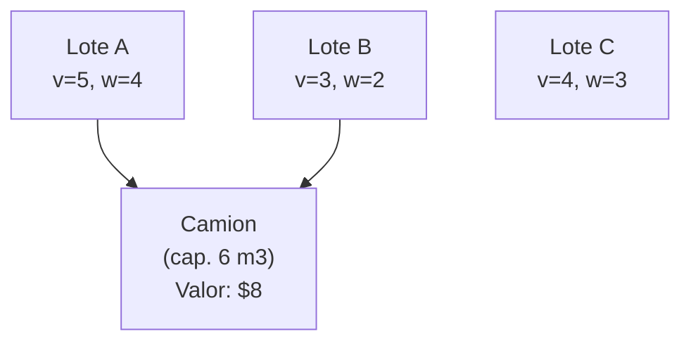

# Ejemplos — Mochila 0/1

## Caso Base — Datos del problema

| Lote | Valor ($) | Volumen (m³) |
|---|---|---|
| Lote A | 5 | 4 |
| Lote B | 3 | 2 |
| Lote C | 4 | 3 |

- **Capacidad del camión**: 6 m³
- **Variables de decisión**: 3 variables binarias ($x_A, x_B, x_C$)

---

## Posibilidades a resolver

El problema consiste en elegir cuáles lotes cargar. Con 3 ítems hay $2^3 = 8$ subconjuntos posibles. El grafo bipartito muestra todas las asignaciones candidatas (camión ← lotes):



---

## Tabla DP desplegada

Filas = ítems considerados acumulativamente. Columnas = capacidad disponible (0–6 m³). Cada celda = valor máximo alcanzable.

| Items \ Capacidad | 0 | 1 | 2 | 3 | 4 | 5 | 6 |
|---|---|---|---|---|---|---|---|
| Base (0 lotes) | 0 | 0 | 0 | 0 | 0 | 0 | 0 |
| + Lote A (w=4) | 0 | 0 | 0 | 0 | 5 | 5 | 5 |
| + Lote B (w=2) | 0 | 0 | 3 | 3 | 5 | 5 | **8** |
| + Lote C (w=3) | 0 | 0 | 3 | 4 | 5 | 7 | **8** |

La celda `dp[2][6] = 8` se calcula como: $\max(5,\; 3 + dp[1][4]) = \max(5, 3+5) = 8$.

---

## Restricciones desplegadas

### R1 — Capacidad (caso base)

$$4x_A + 2x_B + 3x_C \leq 6$$

Con la solución óptima $x_A=1, x_B=1, x_C=0$:

$$4(1) + 2(1) + 3(0) = 6 \leq 6 \quad \checkmark$$

### R2 — Recurrencia (paso clave)

Para `i=2` (Lote B), `w=6`:

$$dp[2][6] = \max\!\bigl(\underbrace{dp[1][6]}_{=5},\; 3 + \underbrace{dp[1][4]}_{=5}\bigr) = \max(5,\; 8) = 8$$

---

## Solución óptima

| Lote | Seleccionado | Valor ($) | Volumen (m³) |
|---|---|---|---|
| Lote A | Sí | 5 | 4 |
| Lote B | Sí | 3 | 2 |
| Lote C | No | — | — |

$$z^* = 5 + 3 = \$8 \quad \text{con } 6/6 \text{ m}^3 \text{ utilizados}$$



| Estructura | Descripción |
|---|---|
| Tipo de asignación | Subconjunto de ítems → un contenedor |
| Relación | Muchos-a-uno |
| Vinculo | Capacidad de peso compartida |

---

## Salida del programa — `caso_base.py`

```
========================================
MOCHILA 0/1 - CASO BASE
========================================
Capacidad del camion : 6 m3
Numero de lotes      : 3

Lotes seleccionados:
  Lote A  |  valor: $5  |  volumen: 4 m3
  Lote B  |  valor: $3  |  volumen: 2 m3

Volumen utilizado : 6 / 6 m3
Valor total       : $8
========================================
```

---

## Salida del programa — `caso_extendido.py`

5 lotes, cap. volumen 10 m³, cap. peso 9 kg, incompatibilidad C-D. Óptimo: $12 (Lote A + Lote D + Lote E).

### Datos del caso extendido

| Lote | Valor ($) | Volumen (m³) | Peso (kg) |
|---|---|---|---|
| Lote A | 3 | 4 | 3 |
| Lote B | 2 | 2 | 2 |
| Lote C | 5 | 3 | 4 |
| Lote D | 8 | 5 | 5 |
| Lote E | 1 | 1 | 1 |

- **Capacidad volumen**: 10 m³
- **Capacidad peso (R4)**: 9 kg
- **Incompatibilidad (R5)**: Lote C y Lote D no pueden coexistir

### Efecto de cada restricción sobre el óptimo

| Restricciones activas | Solución óptima | Valor |
|---|---|---|
| Ninguna (solo volumen 10 m³) | B + C + D | $15 |
| R4 (peso ≤ 9 kg) | C + D | $13 |
| R4 + R5 (incompatibilidad C-D) | **A + D + E** | **$12** |

### Descomposición R5 — dos subproblemas DP

| Subproblema | Lotes candidatos | Valor óptimo |
|---|---|---|
| Sin Lote C | A, B, D, E | **$12** (A + D + E) |
| Sin Lote D | A, B, C, E | $10 (A + B + C) |

Se elige el subproblema con mayor valor → **sin Lote C**, valor = $12.

```
================================================
MOCHILA 0/1 - CASO EXTENDIDO
================================================
Capacidad volumen     : 10 m3
Capacidad peso (R4)   : 9 kg
Incompatibilidad (R5) : Lote C -/- Lote D
Numero de lotes       : 5

  Subproblema sin Lote C : valor = 12
  Subproblema sin Lote D : valor = 10

Lotes seleccionados:
  Lote A  |  valor: $3  |  vol: 4 m3  |  peso: 3 kg
  Lote D  |  valor: $8  |  vol: 5 m3  |  peso: 5 kg
  Lote E  |  valor: $1  |  vol: 1 m3  |  peso: 1 kg

Volumen utilizado : 10 / 10 m3
Peso utilizado    : 9 / 9 kg
Valor total       : $12
================================================
```

---

## Cómo ejecutar

```bash
python caso_base.py
python caso_extendido.py
```
