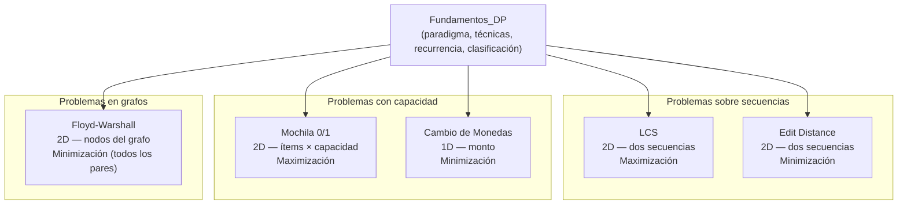

# Programación Dinámica

La **Programación Dinámica** (*Dynamic Programming*, DP) es una técnica de optimización que descompone un problema en subproblemas traslapados (*overlapping subproblems*), almacena sus soluciones para evitar recomputación, y garantiza optimalidad global cuando se cumple el principio de subestructura óptima (*optimal substructure*). Introducida por Richard Bellman (1957) en el contexto de procesos de decisión secuenciales, hoy es uno de los paradigmas fundamentales de la Investigación de Operaciones y el diseño de algoritmos.

---

## Contenido del módulo

| Bloque | Tipo | Tabla DP | Problema |
|---|---|---|---|
| [Fundamentos_DP/](./Fundamentos_DP/) | Marco teórico | — | Paradigma, técnicas, recurrencias, clasificación |
| [Mochila_0-1/](./Mochila_0-1/) | Problema clásico | 2D — ítems × capacidad | Maximizar valor sin exceder capacidad (ítems binarios) |
| [Cambio_Monedas/](./Cambio_Monedas/) | Problema clásico | 1D — monto | Minimizar monedas para alcanzar un monto exacto |
| [Subsecuencia_Comun_LCS/](./Subsecuencia_Comun_LCS/) | Problema clásico | 2D — dos secuencias | Longitud de la subsecuencia común más larga |
| [Distancia_Edicion/](./Distancia_Edicion/) | Problema clásico | 2D — dos secuencias | Mínimo de operaciones para transformar una cadena |
| [Caminos_Cortos_Floyd-Warshall/](./Caminos_Cortos_Floyd-Warshall/) | Problema clásico | 2D — matriz de nodos | Distancias mínimas entre todos los pares de nodos |

---

## Relación pedagógica entre bloques

---

## Cómo navegar este módulo

**Lector nuevo en Programación Dinámica:**
1. Lee `Fundamentos_DP/paradigma.md` — entiende qué es DP y por qué funciona.
2. Lee `Fundamentos_DP/tecnicas.md` — aprende top-down vs. bottom-up.
3. Lee `Fundamentos_DP/recurrencia.md` — aprende a formular recurrencias.
4. Estudia `Mochila_0-1/` como primer problema concreto.
5. Usa `Fundamentos_DP/clasificacion.md` para elegir el siguiente problema según el tipo que te interese.

**Lector con experiencia previa en DP:**
1. Ve directo a `Fundamentos_DP/clasificacion.md` para identificar qué categoría de problema te interesa.
2. Elige el problema y estudia directamente su carpeta.

---

## Referencias

- Bellman, R. (1957). *Dynamic Programming*. Princeton University Press.
- Cormen, T. H. et al. (2022). *Introduction to Algorithms*, 4th ed. MIT Press. Cap. 14.
- Dasgupta, S., Papadimitriou, C., & Vazirani, U. (2006). *Algorithms*. McGraw-Hill. Cap. 6.
