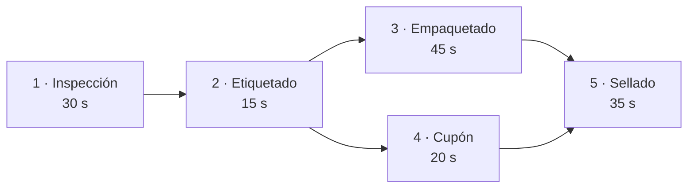
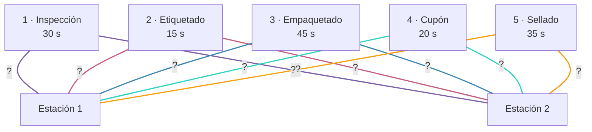
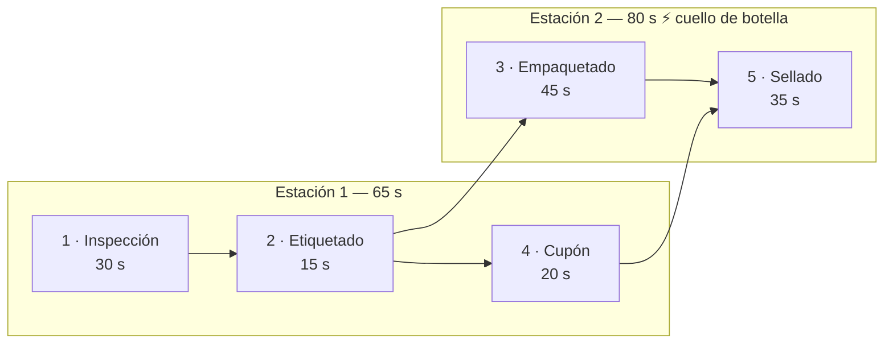
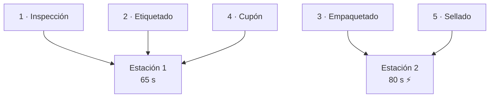
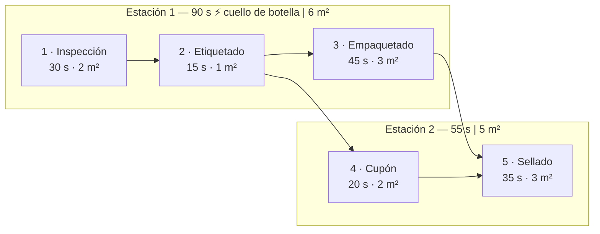
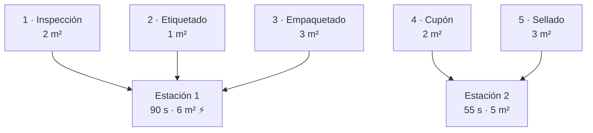

# Ejemplos — Balanceo de Línea de Ensamblaje

## Datos del problema

**Escenario:** Línea de preparación de kits promocionales en un centro logístico.  
5 tareas · 2 estaciones de trabajo.

| Símbolo | Valor |
|---|---|
| $I$ | $\{1, 2, 3, 4, 5\}$ |
| $K$ | $\{1, 2\}$ |
| $P$ | $\{(1,2),(2,3),(2,4),(3,5),(4,5)\}$ |
| $t = [t_1 \dots t_5]$ | $[30, 15, 45, 20, 35]$ s |
| $s = [s_1 \dots s_5]$ | $[2, 1, 3, 2, 3]$ m² *(caso extendido)* |
| $S_k$ | $8$ m² por estación *(caso extendido)* |
| Incompatibles | Tareas 2 y 4 (Etiquetado y Cupón) *(caso extendido)* |

Variables de decisión: $x_{ik} \in \{0,1\}$ para $i \in \{1\dots5\}$, $k \in \{1,2\}$ — 10 variables binarias + $C \geq 0$.

---

### Grafo de precedencias



### Pregunta a resolver: ¿a qué estación va cada tarea?

Antes de optimizar, cada tarea puede asignarse a cualquier estación. El grafo bipartito completo $K_{5,2}$ representa todas las asignaciones posibles:



El modelo selecciona exactamente una arista por tarea (restricción R2) y minimiza el cuello de botella (restricción R1).

---

## Caso 1 — Modelo Base

Implementa R1 (cota minimax), R2 (asignación única con `sum() == 1`) y R3 (precedencia).

### Restricciones desplegadas

**R1 — Cota Minimax:**
- Estación 1: $30x_{1,1} + 15x_{2,1} + 45x_{3,1} + 20x_{4,1} + 35x_{5,1} \leq C$
- Estación 2: $30x_{1,2} + 15x_{2,2} + 45x_{3,2} + 20x_{4,2} + 35x_{5,2} \leq C$

**R2 — Asignación única:**
- $x_{1,1} + x_{1,2} = 1$
- $x_{2,1} + x_{2,2} = 1$
- $x_{3,1} + x_{3,2} = 1$
- $x_{4,1} + x_{4,2} = 1$
- $x_{5,1} + x_{5,2} = 1$

**R3 — Precedencia:**
- $(1,2)$: $x_{1,1} + 2x_{1,2} \leq x_{2,1} + 2x_{2,2}$
- $(2,3)$: $x_{2,1} + 2x_{2,2} \leq x_{3,1} + 2x_{3,2}$
- $(2,4)$: $x_{2,1} + 2x_{2,2} \leq x_{4,1} + 2x_{4,2}$
- $(3,5)$: $x_{3,1} + 2x_{3,2} \leq x_{5,1} + 2x_{5,2}$
- $(4,5)$: $x_{4,1} + 2x_{4,2} \leq x_{5,1} + 2x_{5,2}$

### Solución óptima

| | Tareas | Tiempo (s) |
|---|---|---|
| Estación 1 | 1 (Inspección), 2 (Etiquetado), 4 (Cupón) | 30 + 15 + 20 = **65 s** |
| Estación 2 | 3 (Empaquetado), 5 (Sellado) | 45 + 35 = **80 s** |

$$C^* = 80 \text{ s} \quad \Rightarrow \quad 45 \text{ kits/hora}$$

### Asignación óptima — vista de precedencias



### Asignación óptima — grafo bipartito



**Tipo de asignación según el grafo:**

| Propiedad | Descripción |
|---|---|
| Tipo de grafo | Bipartito — particiones $I$ (tareas) y $K$ (estaciones) |
| Cardinalidad | Muchos-a-uno: múltiples tareas por estación |
| Completitud | Completa: toda tarea queda asignada |
| Sobreyectividad | Toda estación recibe al menos una tarea |
| ¿Es un matching? | No. En un matching clásico cada nodo aparece a lo sumo una vez. Aquí las estaciones reciben varias tareas: es una **partición** del conjunto $I$ en $m = 2$ subconjuntos disjuntos no vacíos. |

### Código del solver

```python
--8<-- "backend/solvers/balanceo_de_linea.py:resolver"
```

### Respuesta de la API

```json
{
  "status": "OPTIMAL",
  "ciclo_optimo": 80,
  "tasa_produccion": 45.0,
  "estaciones": [
    {"numero": 1, "tareas": ["Inspección", "Etiquetado", "Cupón"], "tiempo": 65, "ocio": 15},
    {"numero": 2, "tareas": ["Empaquetado", "Sellado"], "tiempo": 80, "ocio": 0}
  ]
}
```

---

## Caso 2 — Restricciones Adicionales

Extiende el caso base con R4 (incompatibilidad) y R5 (espacio físico). Usa `add_exactly_one` en lugar de `sum() == 1`.

### Restricciones adicionales desplegadas

**R4 — Incompatibilidad (Tareas 2 y 4):**
- Estación 1: $x_{2,1} + x_{4,1} \leq 1$
- Estación 2: $x_{2,2} + x_{4,2} \leq 1$

**R5 — Espacio físico:**
- Estación 1: $2x_{1,1} + 1x_{2,1} + 3x_{3,1} + 2x_{4,1} + 3x_{5,1} \leq 8$
- Estación 2: $2x_{1,2} + 1x_{2,2} + 3x_{3,2} + 2x_{4,2} + 3x_{5,2} \leq 8$

### Asignación óptima — vista de precedencias



### Asignación óptima — grafo bipartito



La restricción de incompatibilidad entre Tareas 2 y 4 garantiza que nunca compartan estación — visible en el grafo: cada una está en un lado diferente.

### Solución óptima

| | Tareas | Tiempo (s) | Espacio (m²) |
|---|---|---|---|
| Estación 1 | 1 (Inspección), 2 (Etiquetado), 3 (Empaquetado) | 30 + 15 + 45 = **90 s** | 6 / 8 |
| Estación 2 | 4 (Cupón), 5 (Sellado) | 20 + 35 = **55 s** | 5 / 8 |

$$C^* = 90 \text{ s} \quad \Rightarrow \quad 40 \text{ kits/hora}$$

La incompatibilidad entre Etiquetado y Cupón fuerza su separación, elevando el cuello de botella de 80 s a 90 s.

### Respuesta de la API

```json
{
  "status": "OPTIMAL",
  "ciclo_optimo": 90,
  "tasa_produccion": 40.0,
  "eficiencia": 80.6,
  "estaciones": [
    {"numero": 1, "tareas": ["Inspección", "Etiquetado", "Empaquetado"], "tiempo": 90, "ocio": 0, "espacio": 6},
    {"numero": 2, "tareas": ["Cupón", "Sellado"], "tiempo": 55, "ocio": 35, "espacio": 5}
  ]
}
```
