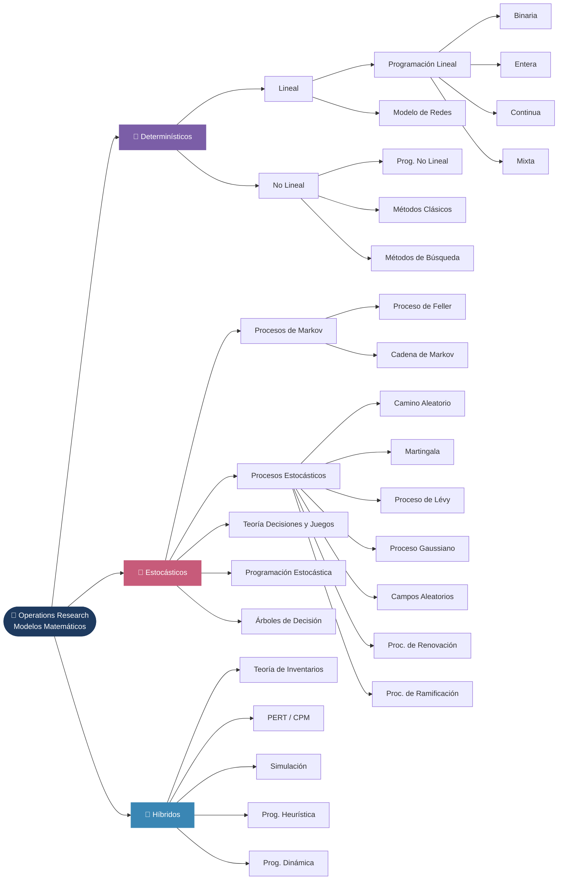

<p align="center">
  
</p>

> **Referencia técnica y práctica de Investigación de Operaciones:**  
> conceptos, algoritmos, código Python ejecutable y demos por sector.

Este repositorio tiene como objetivo reunir en un solo lugar los principales modelos matemáticos de la Investigación de Operaciones, explicados en español, con ejemplos aplicados a sectores reales: industria, banca, logística, transporte y servicios.

Cada tema incluye:
- 📖 Explicación conceptual y fundamentos matemáticos
- 🐍 Código Python ejecutable (notebooks Jupyter)
- 🏭 Casos de uso por sector
- 🔗 Demo interactiva (API de prueba)

---

## 🗺️ Mapa de Contenidos



---

## 📂 Estructura del Repositorio

| Rama | Descripción |
|------|-------------|
| [📐 1\_Deterministicos](./1_Deterministicos/) | Modelos donde los parámetros son conocidos con certeza |
| [🎲 2\_Estocasticos](./2_Estocasticos/) | Modelos que incorporan incertidumbre y probabilidad |
| [🔀 3\_Hibridos](./3_Hibridos/) | Técnicas que combinan elementos determinísticos y estocásticos |

---

## 🚀 Cómo usar este repositorio

### Requisitos

```bash
pip install -r requirements.txt
```

### Ejecutar notebooks

```bash
jupyter notebook
```

Navega a la carpeta del tema de interés y abre el archivo `.ipynb` correspondiente.

---

## 🏭 Aplicaciones por Sector

Los modelos de este repositorio tienen aplicación directa en:

| Sector | Ejemplos de uso |
|--------|-----------------|
| **Industria** | Planificación de producción, corte de materiales, scheduling |
| **Banca y Finanzas** | Gestión de portafolios, evaluación de riesgo, scoring crediticio |
| **Logística** | Ruteo de vehículos, distribución, gestión de almacenes |
| **Transporte** | Flujo en redes, asignación de rutas, timetabling |
| **Servicios** | Programación de turnos, asignación de recursos, colas |
| **Salud** | Programación quirúrgica, distribución de medicamentos |
| **Energía** | Despacho económico, planificación de redes eléctricas |

---

## 🤝 ¿Necesitas ayuda con alguno de estas soluciones?

Si te interesa ahondar sobre problemas de optimización, simulación, toma de decisiones o planificación, escríbenos:

<script src="https://www.google.com/recaptcha/api.js?render=6Lf4GaQtAAAAAJUb5OTjSQZvF7XI9lfiaWxWIqpu"></script>

<div id="contacto-form">
<div style="display:grid; gap:.75rem; max-width:480px;">
  <div>
    <label style="font-size:.85rem; font-weight:600;">Nombre</label><br>
    <input id="c-nombre" type="text" placeholder="Tu nombre"
      style="width:100%; padding:.4rem .6rem; border:1px solid #ccc; border-radius:4px;">
  </div>
  <div>
    <label style="font-size:.85rem; font-weight:600;">Email</label><br>
    <input id="c-email" type="email" placeholder="tu@email.com"
      style="width:100%; padding:.4rem .6rem; border:1px solid #ccc; border-radius:4px;">
  </div>
  <div>
    <label style="font-size:.85rem; font-weight:600;">Mensaje</label><br>
    <textarea id="c-mensaje" rows="4" placeholder="¿En qué podemos ayudarte?"
      style="width:100%; padding:.4rem .6rem; border:1px solid #ccc; border-radius:4px; font-family:inherit; resize:vertical;"></textarea>
  </div>
  <div>
    <button onclick="enviarContacto()"
      style="background:#3f51b5; color:#fff; border:none; padding:.5rem 1.4rem; border-radius:4px; cursor:pointer; font-size:.95rem;">
      Enviar mensaje
    </button>
    <span id="c-status" style="margin-left:.8rem; font-size:.85rem;"></span>
  </div>
</div>
</div>

<script>
function enviarContacto() {
  const nombre = document.getElementById('c-nombre').value.trim();
  const email = document.getElementById('c-email').value.trim();
  const mensaje = document.getElementById('c-mensaje').value.trim();
  const status = document.getElementById('c-status');

  if (!nombre || !email || !mensaje) {
    status.textContent = 'Por favor completa todos los campos.';
    status.style.color = '#c00';
    return;
  }

  status.textContent = 'Enviando…';
  status.style.color = '';

  grecaptcha.ready(function() {
    grecaptcha.execute('6Lf4GaQtAAAAAJUb5OTjSQZvF7XI9lfiaWxWIqpu', {action: 'contacto'})
    .then(function(token) {
      return fetch('https://operations-research-es.vercel.app/contacto', {
        method: 'POST',
        headers: { 'Content-Type': 'application/json' },
        body: JSON.stringify({ nombre, email, mensaje, recaptcha_token: token })
      });
    })
    .then(r => {
      if (!r.ok) throw new Error('Error del servidor');
      return r.json();
    })
    .then(() => {
      status.textContent = '¡Mensaje enviado!';
      status.style.color = '#2a7a2a';
      document.getElementById('c-nombre').value = '';
      document.getElementById('c-email').value = '';
      document.getElementById('c-mensaje').value = '';
    })
    .catch(() => {
      status.textContent = 'No se pudo enviar. Intenta de nuevo.';
      status.style.color = '#c00';
    });
  });
}
</script>

<br>

- 💼 **[LinkedIn]()**
- 🔗 **Demos disponibles:** Cada tema cuenta con una API de prueba para que puedas interactuar con el modelo directamente.

---

## 📄 Licencia

[MIT](./LICENSE) — Libre uso con atribución.
